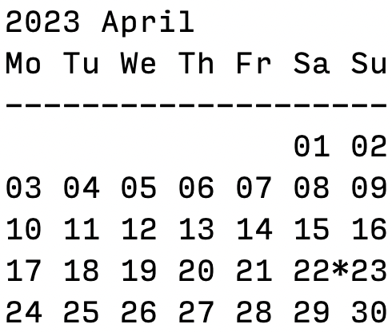

# Month Calendar
This program displays a calendar for the current month in the console.

### Requirements
This program requires Go version 1.16 or higher.
### Usage
To run the program, navigate to the directory containing the source code and run the following command:
```shell
go run main.go
```
This will display a calendar for the current month in the console.
### Features
* Displays a calendar for the current month
* Highlights the current date with a colored background
* Automatically adjusts the calendar to start on the first day of the month
* Wraps the calendar to the next row at the end of each week
* Prints the calendar in a tabular format with columns for each day of the week

### Future Improvements
* Accept command-line arguments for specifying the month and year to display
* Add unit tests for the code

### License
This program is released under the MIT License. See the LICENSE file for details.
